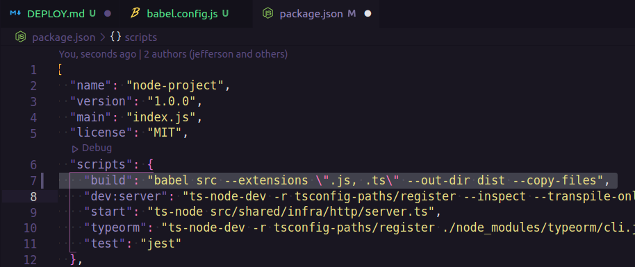

### DEPLOY DE UM BACKEND(API) NODEJS COM TYPESCRIPT

Neste tutorial vou ensinar como fazer o deploy de uma aplicação backend (api) feita em nodejs, este projeto foi construido com typescript não deixe de prestar atenção nas observações.

> **OBS**: Caso sua aplicação seja construida com typescript, ES6 ou alguma versão mais moderna do javascript, vamos precisar da ferramenta **[babel](https://babeljs.io/)**, é uma ferramenta que faz a transpilação de código javascript para uma versão mais entendivel do ambiente de execução seja ele o próprio **browser** (navegador) ou **Node**.

> **OBS**: Outro ponto importante é voce ter um repositório com seu projeto, seja no github, gitlab, gitbucket ou algum outro repositório de código online.

#### Gerando build do projeto

Vamos utilizar a ferramenta **"babel"** para fazer a conversão do nosso código typescript para javascript, para isso vamos instalar algumas bibliotecas como dependencia de desenvolvimento.

```bash
yarn add @babel/cli @babel/core @babel/node @babel/preset-env @babel/preset-typescript babel-plugin-module-resolver -D
```


Em nosso código utilizamos decorators, devido isso em especifico nesse projeto que estamos fazendo o deploy, iremos instalar os plugins abaixo como dependência de desenvolvimento

```bash
yarn add babel-plugin-transform-typescript-metadata @babel/plugin-proposal-decorators @babel/plugin-proposal-class-properties -D
```

Agora no diretório raiz do seu projeto crie o arquivo de configuração do babel chamado **babel.config.js**, e em seguida insira as configurações a seguir, lembrando que essas configurações variam de acordo com cada projeto, de acordo com o **tsconfig.json** do nosso projeto feito com typescript, siga o exemplo abaixo:

```bash
module.exports = {
  presets: [
    ['@babel/preset-env', { target: { node: 'current'} }],
    '@babel/preset-typescript'
  ],
  plugins: [
    ['module-resolver', {
      alias: {
        "@modules": "./src/modules",
        "@config": "./src/config",
        "@shared": "./src/shared",
      }
    }],
    "babel-plugin-transform-typescript-metadata",
    ["@babel/plugin-proposal-decorators", { "legacy": true }],
    ["@babel/plugin-proposal-class-properties", { "loose": true }],
  ],
}
```

Dentro do seu **package.json** na sessão de **"scripts"** crie ou ajuste o script de **build** passando o babel como o transpilador de código para javascript:

```json
 "build": "babel src --extensions \".js, .ts\" --out-dir dist --copy-files"
```



Agora executamos o comando `yarn build` ele ja está configurado no **package.json** do projeto, na lista de arquivos do vscode você percebe que foi gerado um diretório chamado **"dist"** dentro dele está todo o código do projeto convertido para javascript.


