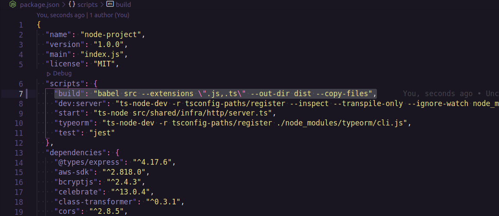

### DEPLOY DE UM BACKEND(API) NODEJS COM TYPESCRIPT

Neste tutorial vou ensinar como fazer o deploy de uma aplicação backend (api) feita em nodejs, este projeto foi construido com typescript não deixe de prestar atenção nas observações.

**O que utilizamos nesse tutorial**
S.O do servidor/vps: **ubuntu server 20.04 LTS**
S.O do computador pessoal: **Ubuntu desktop 20.04 LTS**
Backend App: [API GOBARBER](https://github.com/jefferson1104/gobarber-nodejs)
Se voce utilizar este mesmo projeto do tutorial para executar o deploy, é necessário que voce faça uma cópia desse projeto no seu github, crie um repositório e faça um push desse projeto.

> **OBSERVAÇÃO 1**: Caso sua aplicação seja construida com typescript, ES6 ou alguma versão mais moderna do javascript, vamos precisar da ferramenta **[babel](https://babeljs.io/)**, é uma ferramenta que faz a transpilação de código javascript para uma versão mais entendivel do ambiente de execução seja ele o próprio **browser** (navegador) ou **Node**.

> **OBSERVAÇÃO 2**: Outro ponto importante é voce ter um repositório com seu projeto, seja no github, gitlab, gitbucket ou algum outro repositório de código online.

#### Gerando build do projeto

Vamos utilizar a ferramenta **"babel"** para fazer a conversão do nosso código typescript para javascript, para isso vamos instalar algumas bibliotecas como dependencia de desenvolvimento.

```bash
yarn add @babel/cli @babel/core @babel/node @babel/preset-env @babel/preset-typescript babel-plugin-module-resolver -D
```


Em nosso código utilizamos decorators, devido isso em especifico nesse projeto que estamos fazendo o deploy, iremos instalar os plugins abaixo como dependência de desenvolvimento

```bash
yarn add babel-plugin-transform-typescript-metadata @babel/plugin-proposal-decorators @babel/plugin-proposal-class-properties -D
```

Agora no diretório raiz do seu projeto crie o arquivo de configuração do babel chamado **babel.config.js**, e em seguida insira as configurações a seguir, lembrando que essas configurações variam de acordo com cada projeto, de acordo com o **tsconfig.json** do nosso projeto feito com typescript, siga o exemplo abaixo:

```bash
module.exports = {
  presets: [
    ['@babel/preset-env', { targets: { node: 'current'} }],
    '@babel/preset-typescript'
  ],
  plugins: [
    ['module-resolver', {
      alias: {
        "@modules": "./src/modules",
        "@config": "./src/config",
        "@shared": "./src/shared",
      }
    }],
    "babel-plugin-transform-typescript-metadata",
    ["@babel/plugin-proposal-decorators", { "legacy": true }],
    ["@babel/plugin-proposal-class-properties", { "loose": true }],
  ],
}
```

Dentro do seu **package.json** na sessão de **"scripts"** crie ou ajuste o script de **build** passando o babel como o transpilador de código para javascript:

```json
 "build": "babel src --extensions \".js,.ts\" --out-dir dist --copy-files"
```



Agora executamos o comando `yarn build` ele ja está configurado no **package.json** do projeto, na lista de arquivos do vscode você percebe que foi gerado um diretório chamado **"dist"** dentro dele está todo o código do projeto convertido para javascript.


### CONFIGURANDO SERVIDOR LINUX

> **REQUISITOS**: Você vai precisar de um servidor ou vps, crie ou contrate sua infra-estrutura na empresa que você desejar, eu tenho como preferência utilizar a [digital ocean](https://www.digitalocean.com/) ou té mesmo a [contabo](https://contabo.com/en/), se você tambem utilizar elas, para uma melhor performance recomendo voce utilizar elas com servidores na américa do norte.
> Tenha seu servidor ou VPS com um sistema operacional **linux** e com o **docker** instalado, a distribuição pode ser a que você tenha mais familiaridade não importa se vai ser ubuntu, debian ou qualquer outra.

SISTEMA OPERACIONAL UTILIZADO NESSE GUIA: **UBUNTU**

**Configurações básicas**
Como boa prática de segurança vamos criar um usuário com nome de "**deploy**" e dar as permissoes de sudo para ele, também vamos atualizar os pacotes do nosso sistema operacional, e na home do usuario que criamos vamos criar uma pasta oculta chamda "**.ssh**"

```bash
# Para atualizar vamos executar os comandos
$ sudo apt update
$ sudo apt upgrade

# Criando usuario
$ adduser deploy

# Permissões de sudo
$ usermod -aG sudo deploy

# Acessando a home do usuário deploy
$ cd /home/deploy/

# Criando pasta oculta chamada ssh
$ mkdir .ssh

# Convertendo as opções para o grupo deploy
$ chown deploy:deploy .ssh/

# Dentro da pasta ssh voce pode colocar a chave ssh do seu sistema operacional para ter autorizacao e conseguir acessar o servidor/VPS

# Para criar uma chave ssh voce executa os seguintes comandos no seu sistema operacional (se ele for ubuntu tambem)
$ ssh-keygen

# Apos executar o comando ssh-keygen voce vai gerar dois arquivos, 'id_rsa' e 'id_rsa.pub' suas chaves.
```

**Configurando usuario e usuário docker**
Agora que você criou um usuário com nome "deploy" precisamos fazer login no servidor/vps com este usuário, após fazer o login faça uma configuração de permissão do docker para este usuário.

```bash
# Criando o grupo docker
$ sudo groupadd docker

# Adicionando seu usuário ao grupo docker
$ sudo usermod -aG docker $USER

# Faça logout e login novamente para validar

# execute o comando abaixo para testar
$ docker ps -a

# se caso voce ainda estiver sem permissão, reinicie o servidor/vps
```

**instalação do nodejs e do gerenciador de pacotes yarn**
Como boa prática vamos sempre escolher por instalar a versão LTS do nodejs, onde é garantido mais estabilidade e compatibilidade, também vamos instalar o gerenciador de pacotes yarn.

https://github.com/nodesource/distributions/blob/master/README.md

```bash
# Baixando pacotes do node para a instalação
$ curl -fsSL https://deb.nodesource.com/setup_14.x | sudo -E bash -

# Instalando nodejs
$ sudo apt-get install -y nodejs

# Verificar versão instalada do nodejs
$ node -v

# Verificar versão instalada do NPM
$ npm -v

# Baixar pacotes do repositório yarn
$ curl -sS https://dl.yarnpkg.com/debian/pubkey.gpg | sudo apt-key add -

# Configurando repositório
$ echo "deb https://dl.yarnpkg.com/debian/ stable main" | sudo tee /etc/apt/sources.list.d/yarn.list

# Atualizando lista de repositórios linux
$ sudo apt update

# Instalando yarn
$ sudo apt install --no-install-recommends yarn

# Verificar versão instalada do Yarn
$ yarn -v
```

**Adicionando chaves ssh no github**
Com a chave ssh do seu servidor, você consegue permitir acessos, um deles vai ser para fazer integração e deploy continuo (CI/CD) com o Github.

Também vamos clonar a nossa aplicação de exemplo que utilizamos nesse tutorial.

```bash
# Acessar pasta ssh do servidor
$ cd ~/.ssh/

# Procurar pelos arquivos 'id_rsa' e 'id_rsa.pub'
$ ls

# caso esses arquivos não existir você pode gerar eles
$ ssh-keygen

# Copie o conteúdo
$ cat id_rsa.pub
```


No seu github acesse **settings** > **SSH and GPG keys** e clique no botão **New SSH key**.


A chave que você copiou voce vai colar e dar um nome para essa chave, siga o exemplo da imagem abaixo, depois clique no botão **Add SSH key**.


**Clonando projeto, baixando dependencias e executando build**
Agora faça um clone da aplicação no seu servidor, utilize o conteúdo abaixo como exemplo, lembrando que o projeto que utilizamos nesse tutorial ou qualquer outro tem que estar em um repositório no seu github.

```bash
# Navegando para o diretório raiz do servidor/vps
$ cd

# Criando um diretório para o projeto
$ mkdir app

# Navegando para o diretório app
$ cd app/

# Clonando o projeto
$ git clone git@github.com:jefferson1104/gobarber-nodejs.git

```


Agora acesse o diretório do projeto e faça download de todos os pacotes e dependencias do projeto, após baixar todas as dependencias vamos fazer build da aplicação.

```bash
# Acessando diretório do projeto
$ cd ~/app/gobarber-nodejs/

# Baixando todas as dependencias
$ yarn

# Build do projeto
$ yarn build

```


**Criando imagem docker do PostgreSQL**
Vamos utilizar uma biblioteca chamada "bitnami" para criar as imagens de banco de dados SQL do nosso projeto, segue o link com mais detalhes de como funciona criar uma imagem do PostgreSQL utilizando o bitnami:

- [bitnami-docker-postgresql](https://github.com/bitnami/bitnami-docker-postgresql)

```bash
  # Comando para criar o container do banco de dados postgres
  $ docker run -d --name postgresql -e POSTGRESQL_PASSWORD=gobarber110494 -e POSTGRESQL_USERNAME=postgres -e POSTGRESQL_DATABASE=gobarber -p 35432:5432 bitnami/postgresql:latest

  # Comando para validar se o container está em execução
  $ docker ps -a
```

_EXPLICANDO O COMANDO_

- **docker run** : já cria e executa o container
- **-d** : executa o container em backgorund
- **--name** : nome que você dá ao container
- **-e POSTGRESQL_PASSWORD** : senha de acesso
- **-e POSTGRESQL_USERNAME** : nome de usuário para acesso
- **-e POSTGRESQL_DATABASE** : nome do banco de dados
- **-p** : porta do banco de dados
- **bitnami/postgresql:latest** : imagem que utilizamos para criar o container

> **IMPORTANTE**: no parâmetro "-p" onde fazemos o redirecionamento da porta do banco de dados, note que não utilizamos o padrão 5432 do postgres, nós colocamos a porta 35432, fizemos isso como boa prática e dificultar o ataque de hackers ao tentar acessar esse banco.


Agora vamos deixar configurado no nosso projeto o "**ormconfig**", siga o exemplo do arquivo "**ormconfig.example.deploy.json**", para isso acesse o diretorio raiz do projeto e crie um arquivo com o nome "**ormconfig.json**" dentro desse arquivo deixe igual o que temos abaixo de acordo com os dados que utilizamos para criar o container de banco de dados postgresql.

> **OBSERVAÇÃO**: Utilize o nano como editor de texto no seu servidor, para instalar: `$ sudo apt install nano`. Para abrir um arquivo e editar: `$ nano nomeDoArquivo`

**ormconfig.json**

```json
[
  {
    "name": "default",
    "type": "postgres",
    "host": "localhost",
    "port": 35432,
    "username": "postgres",
    "password": "gobarber110494",
    "database": "gobarber",
    "entities": ["./dist/modules/**/infra/typeorm/entities/*.js"],
    "migrations": ["./dist/shared/infra/typeorm/migrations/*.js"],
    "cli": {
      "migrationsDir": "./dist/shared/infra/typeorm/migrations"
    }
  }
]
```

Para testar se tudo esta correto:

```bash
# Confirme se o container estar em execução
$ docker ps -a

# Caso o container não esteja em execução, execute
$ docker start postgresql

# Para testar a conexão com o banco de dados
$ ./node_modules/.bin/typeorm migration:run
```


**Criando imagem docker do MongoDB**
Vamos utilizar uma biblioteca chamada "bitnami" para criar as imagens de banco de dados NOSQL do nosso projeto, segue o link com mais detalhes de como funciona criar uma imagem do **_MongoDB_** utilizando o bitnami:

- [bitnami-docker-mongodb](https://github.com/bitnami/bitnami-docker-mongodb)

```bash
 # Comando para criar o container do banco de dados MongoDB
 docker run -d --name mongodb -e MONGODB_USERNAME=gobarber -e MONGODB_PASSWORD=gobarber110494 -e MONGODB_DATABASE=gobarber -p 47017:27017 bitnami/mongodb:latest

 # Comando para validar se o container está em execução
 $ docker ps -a
```

_EXPLICANDO O COMANDO_

- **docker run** : já cria e executa o container
- **-d** : executa o container em backgorund
- **--name** : nome que você dá ao container
- **-e MONGODB_USERNAME** : nome de usuário para acesso
- **-e MONGODB_PASSWORD** : senha de acesso
- **-e MONGODB_DATABASE** : nome do banco de dados
- **-p** : porta do banco de dados
- **bitnami/mongodb:latest** : imagem que utilizamos para criar o container

> **IMPORTANTE**: no parâmetro "-p" onde fazemos o redirecionamento da porta do banco de dados, note que não utilizamos o padrão 27017 do postgres, nós colocamos a porta 47017, fizemos isso como boa prática e dificultar o ataque de hackers ao tentar acessar esse banco.

Da mesma maneira que fizemos na etapa anterior, quando configuramos o nosso **ormconfig.json** vamos adicionar o conteúdo do mongodb, deixe seu ormconfig igual como mostra abaixo ou siga ele como exemplo.

**ormconfig.json**

```json
[
  {
    "name": "default",
    "type": "postgres",
    "host": "localhost",
    "port": 35432,
    "username": "postgres",
    "password": "gobarber110494",
    "database": "gobarber",
    "entities": ["./dist/modules/**/infra/typeorm/entities/*.js"],
    "migrations": ["./dist/shared/infra/typeorm/migrations/*.js"],
    "cli": {
      "migrationsDir": "./dist/shared/infra/typeorm/migrations"
    }
  },
  {
    "name": "mongo",
    "type": "mongodb",
    "host": "localhost",
    "port": 47017,
    "username": "gobarber",
    "password": "gobarber110494",
    "database": "gobarber",
    "useUnifiedTopology": true,
    "entities": ["./dist/modules/**/infra/typeorm/schemas/*.js"]
  }
]
```

**Criando imagem docker do Redis**
Vamos utilizar uma biblioteca chamada "bitnami" para criar as imagens de banco de dados de cache em nosso projeto, segue o link com mais detalhes de como funciona criar uma imagem do **REDIS** utilizando o bitnami:

- [bitnami-docker-redis](https://github.com/bitnami/bitnami-docker-redis)

```bash
 # Comando para criar o container do banco de dados MongoDB
 docker run -d --name redis -e REDIS_PASSWORD=gobarber110494 -p 56379:6379 bitnami/redis:latest

 # Comando para validar se o container está em execução
 $ docker ps -a
```

_EXPLICANDO O COMANDO_

- **docker run** : já cria e executa o container
- **-d** : executa o container em backgorund
- **--name** : nome que você dá ao container
- **-e REDIS_PASSWORD** : senha de acesso
- **-p** : porta do banco de dados
- **bitnami/redis:latest** : imagem que utilizamos para criar o container

> **IMPORTANTE**: no parâmetro "-p" onde fazemos o redirecionamento da porta do banco de dados, note que não utilizamos o padrão 6379 do postgres, nós colocamos a porta 56379, fizemos isso como boa prática e dificultar o ataque de hackers ao tentar acessar esse banco.

Agora vamos configurar o arquivo **.env** e para isso vamos utilizar o nosso **.env.example** como modelo, no diretório raiz do projeto vamos criar o arquivo com o seguinte conteúdo:

```bash
APP_SECRET=gobarber110494
APP_API_URL=http://localhost:3333
APP_WEB_URL=http://localhost:3000

# AWS IAM USER
AWS_ACCESS_KEY_ID=
AWS_SECRET_ACCESS_KEY=
AWS_DEFAULT_REGION=

# STORAGE
STORAGE_DRIVER=disk

# EMAIL
MAIL_DRIVER=ethereal

# REDIS
REDIS_HOST=localhost
REDIS_PORT=56379
REDIS_PASS=gobarber110494
```

**TESTANDO APLICAÇÃO !!**

```bash
# Para validar que todas as configurações estão corretas.
# Para validar todas as conexões com os bancos de dados.

# Execute
$ node dist/shared/infra/http/server.js
```


**NGINX E PROXY REVERSO**
NGINX é um servidor web que também funciona como proxy de email, proxy reverso, e balanceador de carga. A estrutura do software é assíncrona e orientada a eventos, vamos agora instalar e configurar o **niginx** para que nosso projeto funcione como queremos com acessso externo na porta 80 e com proxy reverso.

```bash
# Instalando nginx
$ sudo apt install nginx

# Liberando acesso externo na porta 80
$ sudo ufw allow 80
```

Para testar acesse seu servidor pelo browser


**configurando**
Vamos acessar o diretório **sites-available** e vamos começar a editar o arquivo **default** encontrado dentro deste diretório, claro vamos criar um arquivo para nosso projeto **gobarber**.

```bash
# Acessando diretorio sites-available
$ cd /etc/nginx/sites-available

# Transformando-se em super usuario
$ sudo su

# Criando um arquivo utilizando o default como modelo
$ cp default gobarber

# editando arquivo gobarber com o nano
$ nano gobarber

# Deixe o conteudo do arquivo gobarber igual ao conteudo abaixo e salve o arquivo
server {
  listen 80 default_server;
  listen [::]:80 default_server;

  server_name _;

  location / {
    proxy_pass http://localhost:3333;
    proxy_http_version 1.1;
    proxy_set_header Upgrade $http_upgrade;
    proxy_set_header Connection 'upgrade';
    proxy_set_header Host $host;
    proxy_cache_bypass $http_upgrade;
  }
}

# Agora acesse o diretório sites-enable
$ cd /etc/nginx/sites-enabled

# Vamos criar um link simbolico
$ ln -s /etc/nginx/sites-available/gobarber  gobarber

# Deletando o default
$ rm default
```


Testando se a configuração esta correta, execute o comando

```bash
# Testando configuração
$ nginx -t

# Reiniciando serviço do nginx
$ service nginx restart

# Sair do modo super usuario
$ exit
```


```bash
# Votamos para o diretório raiz do projeto
$ cd ~/app/gobarber-nodejs/

# Iniciamos a aplicação
$ node dist/shared/infra/http/server.js
```

Acessamos o servido via browser para testar, o esperado que é que seja igual a imagem abaixo:


## AUTOMATIZANDO E AJUSTANDO SERVIDOR

Agora vamos manter todos os seviços no ar, manter nossos containers docker em execução mesmo que nosso servidor seja reiniciado, e também utilizando o gerenciador de processos **PM2** para manter a aplicação sempre em execução.

**Docker containers**

```bash
# Pegar a informação CONTAINER ID
$ docker ps -a

# Mantendo os containers docker em execução sempre
$ docker update --restart=unless-stopped <CONTAINER ID>

```


**PM2**

```bash
# Instalando PM2
$ sudo npm install -g pm2

# Configurando PM2 para a aplicaçao
$ pm2 start dist/shared/infra/http/server.js --name gobarber-api

# Acompanhar as aplicacoes em execução
$ pm2 list

# Verificar logs
$ pm2 logs

# Monitorar aplicações
$ pm2 monit
```


Para finalizar, vamos configurar o pm2 para inicializar toda vez que o servidor for iniciado ou reiniciado, para isso vamos executar primeiro o comando:

```bash
pm2 startup systemd
```


Vamos copiar o comando que foi gerado como mostra na imagem acima, e executar em nosso terminal também


> **IMPORTANTE**: caso voce for executar mais de um projeto node no mesmo servidor, é importante toda vez que adicionar uma nova aplicação na lista do pm2 executar tambem o comando `pm2 save`

## CONFIGURANDO SSL E DOMINIO

Antes de iniciar essa etapa, é necessário você ter um **dominío** e também já ter feito o seu **apontamento** para o servidor/vps que contém sua aplicação.

**configurando dominio no nginx**

```bash
# Acesse novamente o diretorio sites-available
$ cd /etc/nginx/sites-available/

# Edite o arquivo referente a sua aplicação
$ nano gobarber

# Procure pela linha onde contem "server_name"

# Deixe essa linha com seu dominio como no ex abaixo:
server_name meudominio.com;

# Salve a alteração e teste com o comando
$ ngix -t

# reinicie o nginx
$ service nginx restart
```

**configurando certificado ssl gratuito**
Utilizando o lets-encript vamos fazer nosso certificado ssl gratuito, para isso siga as instruções abaixo:

```bash
# Removendo qualquer configuração ou instalação inicial
$ sudo apt-get remove certbot

# Instalando certbot
$ sudo snap install --classic certbot

# Preparando comando do certbot
$ sudo ln -s /snap/bin/certbot /usr/bin/certbot

# Inicia a configuração do certificado
$ sudo certbot --nginx

# No fim quando acabar a configuração do certificado ssl, vamos liberar a porta 443
$ sudo ufw allow 443
```

FONTE: https://certbot.eff.org/lets-encrypt/ubuntufocal-nginx

## CI/CD GITHUB (INTEGRAÇÃO E DEPLOY CONTINUO)

Utilizando o **github actions** podemos ter a integração continua da aplicação, ou seja toda vez que houver um commit na branch master da aplicação, automaticamente essa alteração vai para produção, o servidor é reiniciado, vai ser executada as migrations, instalar as dependencias novamente do projeto e etc.

**Criando as variaveis secretas**
Acesse o repositório do projeto, vá até a opção '**settings**', clique na opção '**secrets**', e em seguida no botão '**New repository secret**'.


Vamos gerar uma chave ssh exclusivamente para o github actions **na sua maquina pessoal**.

```bash
# Criar chave ssh e dar o nome dela de 'github_actions'
$ ssh-keygen

# Copie o conteúdo de dentro dessa chave
$ cat github_actions.pub
```

Após copiar a chave ssh do seu github_actions, acesse novamente o servidor/vps e vamos salvar a chave.

```bash
# Acessar a pasta ssh
$ cd .ssh/

# Criar o arquivo authorized_keys
$ nano authorized_keys

#Colar o conteudo da chave ssh github_actions no arquivo 'authorized_keys'.
```


Vamos criar algumas variáveis de acordo com a lista abaixo insira os dados '**Name**' e '**Value**'.

```bash
# Ip do servidor/vps
Name: SSH_HOST
Value: 192.168.1.44

# Usuário do servidor/vps
Name: SSH_USER
Value: deploy

# Porta ssh do servidor/vps
Name: SSH_PORT
Value: 22

## Na sua maquina pessoal, copie agora o conteúdo do arquivo 'github_actions'
$ cd .ssh/

$ nano github_actions

# apos copiar esse conteudo da sua maquina pessoal, cria a variavel
Name: SSH_KEY
Value: conteudo que voce copiou da chave ssh github_actions da sua maquina pessoal
```


**Criando workflow**
Acesse o repositório do projeto, vá até a opção '**Actions**', clique no link '**set up a workflow yourself**'


Dentro vamos criar um workflow como mostra no modelo abaixo:

```bash
name: CI

on:
  push:
    branches: [ main ]

jobs:
  build:
    runs-on: ubuntu-latest

    steps:
      - uses: actions/checkout@v2

      - name: Setup Node.js environment
        uses: actions/setup-node@v1.4.5
        with:
          node-version: 14.x

      # Instalar as dependências do projeto
      - name: Install dependecies
        run: yarn

      # Executar a build do projeto
      - name: Run build
        run: yarn build

      # Copiar código novo para dentro do servidor/vps
      - name: Copy files to server/vps
        uses: appleboy/scp-action@master
        with:
          host: ${{ secrets.SSH_HOST }}
          username: ${{ secrets.SSH_USER }}
          port: ${{ secrets.SSH_PORT }}
          key: ${{ secrets.SSH_KEY }}
          source: ".,!node_modules"
          target: "~/app/gobarber-nodejs"

      # Executar 'yarn' no servidor/vps
      # Executar as migrations do typeORM
      # Reiniciar servidor node.js
      - name: Run production scripts
        uses: appleboy/scp-action@master
        with:
          host: ${{ secrets.SSH_HOST }}
          username: ${{ secrets.SSH_USER }}
          port: ${{ secrets.SSH_PORT }}
          key: ${{ secrets.SSH_KEY }}
          script: |
            cd ~/app/gobarber-nodejs
            yarn
            ./node_modules/.bin/typeorm migration:run
            pm2 restart gobarber-api


```


