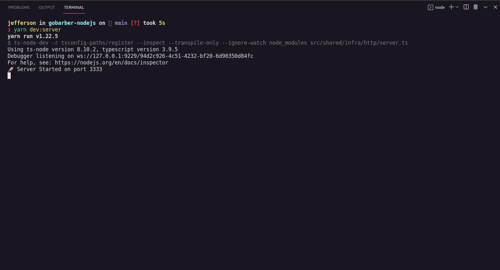
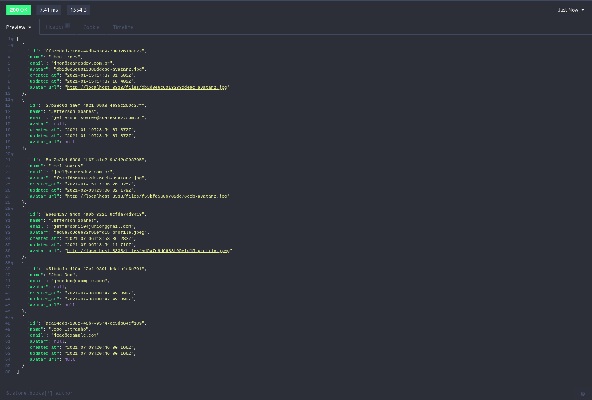
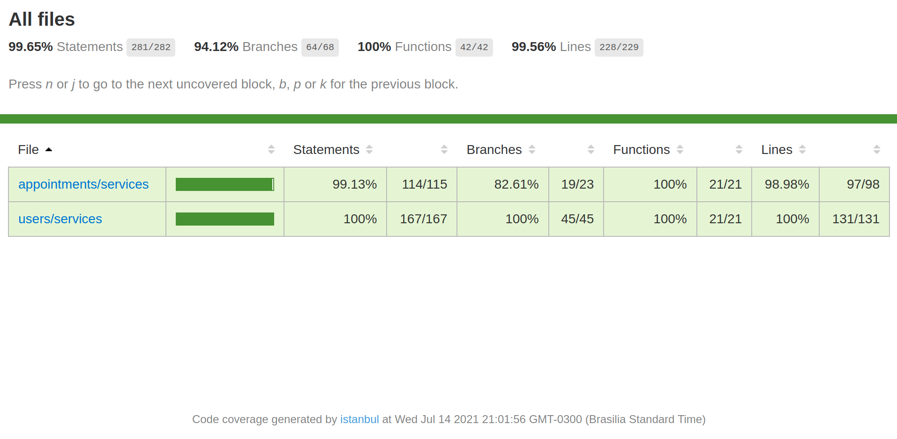

<h1 align="center">BACKEND (API)</h1>
<div align="center" style="margin-bottom: 20px;">
  
</div>

<p align="center">

  

  

  
</p>

#### :barber: O projeto

Backend do projeto gobarber feito com nodejs utilizando typescript, aplicando o conjunto de principios e boas praticas SOLID, TDD e DDD.

#### :rocket: Principais tecnologias

- [TypeScript](https://www.typescriptlang.org/docs/)
- [NodeJS](https://nodejs.org/en/)
- [ExpressJS](https://expressjs.com/pt-br/)
- [Jest](https://jestjs.io/pt-BR/)
- [PostgresSQL](https://www.postgresql.org/)
- [MongoDB](https://www.mongodb.com/pt-br)
- [Redis](https://redis.io/)
- [NodeMailer](https://nodemailer.com/about/)

#### :zap: Como executar este projeto

Dentro do projeto, já existe um arquivo _docker-compose.yml_ que possui 3 contêiners **Docker**, um contêiner com o banco de dados **PostgresSQL**, um contêiner com banco de dados **MongoDB** e outro contêiner com o banco de dados para cache **Redis**, basta ter o Docker instalado em sua máquina.

Para iniciar o backend do projeto (API):

```Bash
# Acesse o diretório backend
$ cd gobarber-nodejs

# Instale todas as dependencias do projeto
$ yarn

# Crie os containers com PostgresSQL, MongoDB e Redis (necessário ter o docker instalado na máquina)
# O comando abaixo iniciará em background e não irá bloquear o shell
$ sudo docker-compose up -d

# Comando para verificar se os containers estão em execução
$ sudo docker ps -a

# Execute as migrations para o banco de dados
$ yarn typeorm migration:run

# Iniciar backend do goBarber localmente na porta 3333
$ yarn dev:server
```

#### 🎨 Imagens

<p align="center">
  <a href='./assets/images/screenshots/'>
    
  </a>

  <a href='./assets/images/screenshots/'>
    
  </a>

  <a href='./assets/images/screenshots/'>
    
  </a>
</p>

### :memo: Licença

Este projeto é desenvolvido sob a licença MIT. Veja o arquivo [LICENSE](LICENSE.md) para saber mais detalhes.
